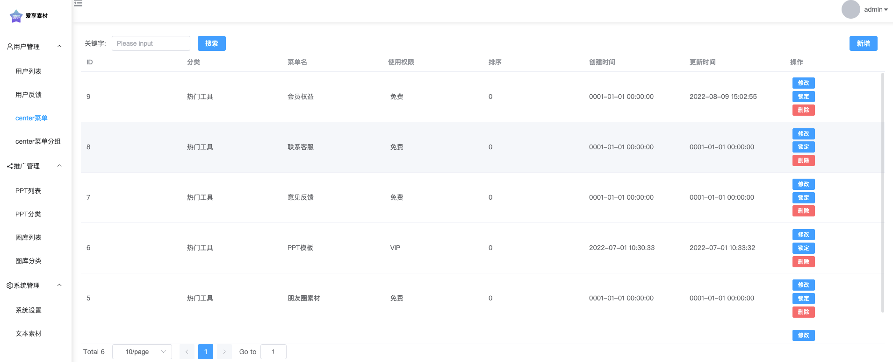

## 爱享素材后台(前端页面)

### 安装
```shell
yarn

# 修改根环境变量文件内容

# 运行
yarn run dev

```

### 服务器部署
```shell
# 构建出dist, 将dist目录上传到服务器 在配置nginx
yarn build

# nginx伪静态
location / {
  index  index.html index.htm;
  try_files $uri $uri/ /index.html;
}
```

### 效果图


